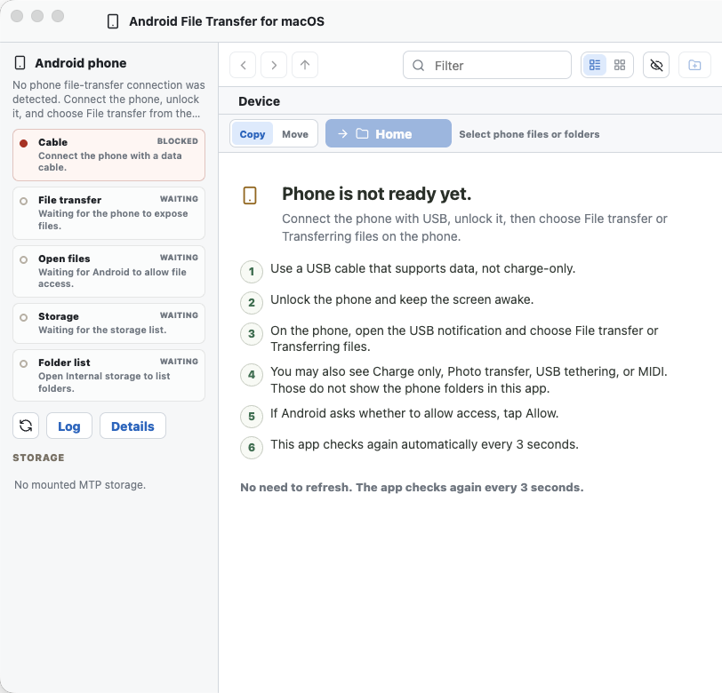

# Android File Transfer for macOS

Free and open-source USB file transfer between Android devices and macOS. No cloud, account, subscription, or companion app.

This is basic device interoperability. It should be built into macOS. Until it is, this project provides it.

> **Early public release:** v0.1.0 is available for testing across more Android devices and Mac configurations. Please report the phone model, macOS version, and the app's privacy-bounded Copy Report when something does not work.



## Download

Download the DMG for your Mac from [GitHub Releases](https://github.com/nostitos/android-file-transfer-for-macos/releases):

- `arm64` for Apple silicon Macs
- `x64` for Intel Macs

Both the app and DMG are signed with an Apple Developer ID, notarized by Apple, and stapled for Gatekeeper. Release checksums are published in `SHA256SUMS.txt`.

## What it does

- Browses Android storage over USB MTP with list and grid views.
- Copies files and folders from Android to the Mac or from the Mac to Android.
- Supports Finder drag and drop, including direct phone-to-Finder file promises.
- Queues transfers with progress, speed, ETA, cancellation, and retry controls.
- Queue summaries show copied-of-total bytes, active speed, ETA, and completed or failed counts.
- 4GB+ copies are allowed to keep running while progress events arrive; the timeout detects stalled transfers rather than imposing a fixed duration.
- Downloads publish atomically without overwriting, and the app checks the actual destination volume for enough free space before copying.
- Downloads preserve the phone file's modified date, and copied folders keep their phone modified dates after their contents finish.
- Multiple connected phones are supported, and each phone keeps its own browsing state.
- Right-click context menus expose the same guarded actions as the toolbar and keyboard shortcuts.
- Shift-click range selection and selection summaries work in both file panes.
- Show or hide hidden files in both panes; hidden files stay hidden by default.
- Recursive copies show Preparing folder copy feedback and a Stop action before any transfer jobs are queued.
- Keeps routine polling and empty keyboard actions quiet.
- Shows USB detection, File Transfer mode, file-session state, storage, and folder loading as separate stages.
- Gives distinct guidance for a locked phone or Android Allow prompt.
- Static startup and renderer-crash fallbacks prevent a bundle or display failure from leaving an empty white window.

The app intentionally does not provide general phone-side delete, rename, overwrite, or folder Move. A source file can be deleted only after an explicitly confirmed file Move has verified the destination copy.

## Requirements

- macOS 12 Monterey or newer
- Apple silicon or Intel Mac
- Android device connected by USB with **File Transfer**, **Transferring files**, or **MTP** selected

No Homebrew installation is needed for the downloaded app. The DMGs include pinned libmtp and libusb libraries.

## Use

1. Install the DMG matching your Mac and drag the app to Applications.
2. Connect and unlock the Android device.
3. Choose File Transfer from the Android USB notification and approve Android's data-access prompt if it appears.
4. Browse the phone and Mac panes, select files or folders, then use the directional Copy controls or drag and drop.

USB visibility does not always mean the phone's folders are open. If the app says **USB visible**, follow the **Open files** action. macOS may request the Mac login password to open one protected USB session; the app explains that request before the system prompt appears. The helper drops back to the logged-in account before accepting file commands.

## Privacy and security

- No analytics, telemetry, advertising, account, or network file transfer.
- File transfers stay between the connected Android device and the Mac.
- Copy Report excludes phone file listings and contains bounded connection diagnostics only.
- Release builds use hardened runtime, Developer ID signing, Apple notarization, and Gatekeeper verification.
- Security reports should follow [SECURITY.md](SECURITY.md).

## Build from source

Install Node.js 22.12 or newer, Xcode Command Line Tools, and `pkg-config`, then run:

```sh
brew install pkg-config
npm ci
export ARCH="$(node -p 'process.arch')"
npm run native:deps -- "$ARCH"
export NATIVE_DEPS_PREFIX="$PWD/.native-deps/$ARCH"
npm run check
npm run dev
```

The native dependency script downloads libusb 1.0.30 and libmtp 1.1.23 from their upstream release locations, verifies pinned SHA-256 checksums, and compiles them with a macOS 12 deployment target. Development builds are ad-hoc signed; public releases require the Developer ID and notarization workflow in `.github/workflows/release.yml`.

Useful checks:

```sh
npm run check
npm run check:public-source
npm audit --omit=dev
```

Architecture and MTP command details are in [docs/architecture.md](docs/architecture.md). The full real-device checklist is in [docs/manual-test-checklist.md](docs/manual-test-checklist.md).

## Contributing

Bug reports and focused pull requests are welcome. Read [CONTRIBUTING.md](CONTRIBUTING.md) before submitting changes.

This project is released under the [MIT License](LICENSE). Its bundled libmtp and libusb libraries are LGPL-2.1-or-later; exact notices and corresponding source information are in [THIRD_PARTY_NOTICES.md](THIRD_PARTY_NOTICES.md) and each release's `THIRD_PARTY_SOURCES` archive.

Android is a trademark of Google LLC. macOS is a trademark of Apple Inc. This independent project is not affiliated with or endorsed by Google or Apple.
