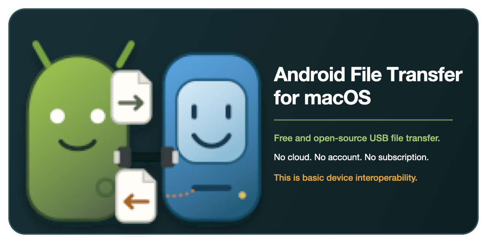
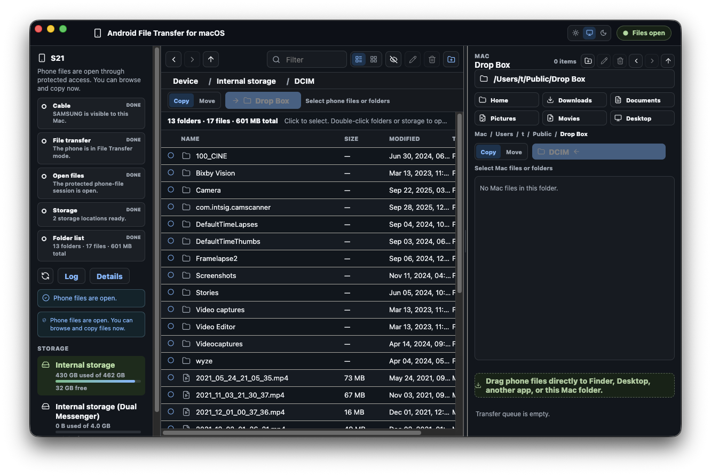

# Android File Transfer for macOS

Free and open-source USB file transfer between Android devices and macOS. No cloud, account, subscription, or companion app.

This is basic device interoperability. It should be built into macOS. Until it is, this project provides it.



> **Early public release:** v0.2.0 is available for testing across more Android devices and Mac configurations. Please report the phone model, macOS version, and the app's privacy-bounded Copy Report when something does not work.



## Download

Download the DMG for your Mac from [GitHub Releases](https://github.com/nostitos/android-file-transfer-for-macos/releases):

- `arm64` for Apple silicon Macs
- `x64` for Intel Macs

Both the app and DMG are signed with an Apple Developer ID, notarized by Apple, and stapled for Gatekeeper. Release checksums are published in `SHA256SUMS.txt`.

## What it does

- Browses Android storage and Mac folders with independent list and grid views.
- Copies files and folders from Android to the Mac or from the Mac to Android.
- Supports Finder drag and drop, including direct phone-to-Finder file promises.
- Queues transfers with progress, speed, ETA, cancellation, and retry controls.
- Queue summaries show copied-of-total bytes, active speed, ETA, and completed or failed counts.
- 4GB+ copies are allowed to keep running while progress events arrive; the timeout detects stalled transfers rather than imposing a fixed duration.
- Same-name files offer Keep Both, Replace, Skip Existing, or Cancel. Mac replacement is atomic, and phone replacement verifies a staged copy before changing the old file.
- The app checks the actual destination volume for enough free space before copying to the Mac.
- Downloads preserve the phone file's modified date, and copied folders keep their phone modified dates after their contents finish.
- Multiple connected phones are supported, and each phone keeps its own browsing state.
- Renames phone files and folders, and permanently deletes selected phone items after a native confirmation.
- Creates and renames Mac items in the local pane; Mac delete moves items to the recoverable macOS Trash.
- Right-click context menus expose the same guarded actions as the toolbar and keyboard shortcuts.
- Shift-click range selection and selection summaries work in both file panes.
- Show or hide hidden files independently in each pane; hidden files stay hidden by default.
- Recursive copies show Preparing folder copy feedback and a Stop action before any transfer jobs are queued.
- Keeps routine polling and empty keyboard actions quiet.
- Checks the project's GitHub Releases at most once per day and shows a compact Update action only when a newer version exists; Help > Check for Updates gives an immediate result.
- Shows USB detection, File Transfer mode, file-session state, storage, and folder loading as separate stages.
- Automatically opens one MTP session when File Transfer appears and reuses it for browsing and copying.
- Gives distinct guidance for a locked phone or Android Allow prompt.
- Static startup and renderer-crash fallbacks prevent a bundle or display failure from leaving an empty white window.

Phone rename and permanent delete verify the selected object's ID, storage, parent, kind, current name, and available file size/time immediately before changing it. Delete has no Trash or Undo and always requires a native confirmation. Uploads read from the same Mac file descriptor whose identity was queued, so a changed or swapped source is rejected. Same-name replacement is explicit: the new phone file uploads under a temporary name, is verified, and the old file remains under a backup name until the new name is verified. Folder Move is not offered.

## Requirements

- macOS 12 Monterey or newer
- Apple silicon or Intel Mac
- Android device connected by USB with **File Transfer**, **Transferring files**, or **MTP** selected

No Homebrew installation is needed for the downloaded app. The DMGs include pinned libmtp and libusb libraries.

## Use

1. Install the DMG matching your Mac and drag the app to Applications.
2. Connect and unlock the Android device.
3. Choose File Transfer from the Android USB notification and approve Android's data-access prompt if it appears. The app detects the mode change and opens the phone automatically.
4. Wait for the storage list, then browse the phone and Mac panes, select files or folders, and use the directional Copy controls or drag and drop.

USB visibility does not mean the phone has answered the file request yet. Each opening attempt is bounded, and the app keeps trying automatically every few seconds while the phone remains connected in File Transfer mode. It stops only when the phone opens, the cable is removed, or you press Cancel. The app never asks for the Mac login password to open a phone.

## Privacy and security

- No analytics, telemetry, advertising, account, or network file transfer.
- Update checks contact only this project's public GitHub Releases API and send the app version in the standard request identifier; no phone or file information is included.
- File transfers stay between the connected Android device and the Mac.
- Copy Report excludes phone file listings and contains bounded connection diagnostics only.
- Release builds use hardened runtime, Developer ID signing, Apple notarization, and Gatekeeper verification.
- Security reports should follow [SECURITY.md](SECURITY.md).

## Build from source

Install Node.js 22.12 or newer, Xcode Command Line Tools, and `pkg-config`, then run:

```sh
brew install pkg-config
npm ci
export ARCH="$(node -p 'process.arch')"
npm run native:deps -- "$ARCH"
export NATIVE_DEPS_PREFIX="$PWD/.native-deps/$ARCH"
npm run check
npm run dev
```

The native dependency script downloads libusb 1.0.30 and libmtp 1.1.23 from their upstream release locations, verifies pinned SHA-256 checksums, and compiles them with a macOS 12 deployment target. Development builds are ad-hoc signed; public releases require the Developer ID and notarization workflow in `.github/workflows/release.yml`.

Useful checks:

```sh
npm run check
npm run check:public-source
npm audit --omit=dev
```

Architecture and MTP command details are in [docs/architecture.md](docs/architecture.md). The full real-device checklist is in [docs/manual-test-checklist.md](docs/manual-test-checklist.md), and signed-release requirements are in [docs/release-runbook.md](docs/release-runbook.md).

## Contributing

Bug reports and focused pull requests are welcome. Read [CONTRIBUTING.md](CONTRIBUTING.md) before submitting changes.

This project is released under the [MIT License](LICENSE). Its bundled libmtp and libusb libraries are LGPL-2.1-or-later; exact notices and corresponding source information are in [THIRD_PARTY_NOTICES.md](THIRD_PARTY_NOTICES.md) and each release's `THIRD_PARTY_SOURCES` archive.

Android is a trademark of Google LLC. macOS is a trademark of Apple Inc. This independent project is not affiliated with or endorsed by Google or Apple.
