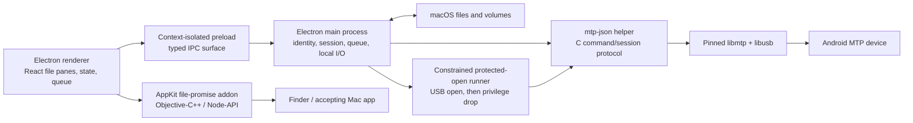

# Technical architecture and improvement roadmap

Roadmap snapshot: **2026-07-22**

**Release decision, 2026-09-27:** the planned v0.2.0 launch targets macOS 13+ with a current supported Electron line and a user-approved updater. The v0.1.0 architecture and audit facts below remain historical; forward-looking macOS 12 and update-notification suggestions have been superseded by this release decision. The exact public feature list still depends on the signed release handoff in [claims-ledger.md](claims-ledger.md).

This document describes three different things deliberately:

- **Public baseline:** behavior in downloadable v0.1.0 from source commit `e3add3913a6500b4f3ed3ab7f7e35857bd24482b`.
- **Local development:** implemented or partially implemented changes in the dirty worktree on top of committed `main` at `1c6dfa2`.
- **Future work:** ideas and acceptance criteria, not promises or shipped capabilities.

The public-claim boundary is defined in [claims-ledger.md](claims-ledger.md). Market motivation is in [competitive-landscape.md](competitive-landscape.md).

## Product engineering principles

1. **Basic interoperability first.** The primary job is browse and transfer over a direct USB connection, not phone backup, remote control, cloud storage, messaging, or an account ecosystem.
2. **No destructive surprise.** Never overwrite or delete merely because a name looks familiar. Bind an operation to the exact source/destination identity and verify the completed copy before a Move removes its source.
3. **Connection states are not interchangeable.** Cable visibility, Android File Transfer mode, an open MTP session, readable storage, and a loaded folder are separate facts.
4. **MTP is a fallible device protocol.** Expect devices to reject operations, re-enumerate, omit metadata, lock mid-command, and disappear without a clean close.
5. **Least privilege.** If macOS protection requires an elevated USB open, constrain the scope, execute from root-owned staging, drop to the logged-in user before accepting file commands, and make the request understandable.
6. **Local by default.** Do not add an account, cloud payload path, telemetry, or phone companion merely to imitate broader suites.
7. **Evidence before marketing.** A contract test proves a code path; only a release artifact plus hardware validation proves a public capability.
8. **Keep the app understandable.** Advanced features should remain explicit tools rather than turning a basic transfer utility into an always-on device-management platform.

## Current architecture



### Renderer

The renderer is an Electron/React UI responsible for:

- Android and Mac file panes.
- Connection-stage presentation and recovery guidance.
- Lazy navigation, sorting, selection, list/grid presentation where supported, hidden-file visibility, and context/keyboard actions.
- Transfer planning and queue presentation: bytes, speed, ETA, outcome, cancel, and retry.
- Per-device browsing state and guarding against stale asynchronous results.

It does not receive unrestricted Node.js access. Privileged or filesystem work crosses the preload IPC boundary.

### Preload and IPC boundary

The context-isolated preload exposes a deliberately enumerated API from renderer to main. Shared TypeScript types define connection identity, MTP objects, transfer jobs, progress, local entries, and diagnostics. Improvement work must preserve:

- No arbitrary shell execution from renderer messages.
- Schema/shape validation for every mutation request, not TypeScript trust alone.
- Request identifiers so a late folder result cannot populate a newly selected device or path.
- Physical connection identity in every device-bound command; native list indices are routing hints, not durable identity.

### Electron main process

Main owns:

- USB/MTP status and device-selection orchestration.
- Long-lived helper lifecycle and serialized command/transfer execution.
- Transfer queue scheduling, cancellation, retry, atomic Mac publication, free-space checks, and Finder reveal.
- Local filesystem enumeration and safe path handling.
- Folder selection and macOS dialogs.
- Privacy-bounded diagnostics.
- The protected-open flow when a normal process cannot acquire the selected MTP interface.

The public v0.1.0 queue is sequential. This is conservative: many MTP devices do not behave reliably with parallel object commands, and concurrent helpers can race for exclusive USB ownership.

### `mtp-json` native helper

`src/native/mtp-json.c` builds a small native executable around libmtp/libusb. Public v0.1.0 provides one-shot diagnostics plus a persistent `session` mode. Its core command families are:

- raw status and device/storage inventory;
- lazy one-folder listing;
- file download with throttled progress;
- phone folder creation;
- upload with returned-object verification;
- tightly scoped source deletion after a verified file Move;
- graceful quit, with process termination only as a timeout/cancel fallback.

Storage root uses MTP root parent `0xffffffff`. Large transfers refresh an **idle** timeout when progress arrives instead of failing at a fixed total duration. A Samsung-specific fallback can expose an internal synthetic storage row and build a cached object index when the phone opens but omits useful storage metadata.

Local development expands the helper protocol with identity-checked rename/delete, explicit destination names, descriptor-bound upload, and staged phone replacement. Those operations are not v0.1.0 claims.

### MTP session and device identity

The normal path opens one libmtp device session and reuses it for inventory, navigation, and transfer. This avoids repeated `OpenSession` races. The application distinguishes:

1. no USB device;
2. USB device present but not in MTP/File Transfer mode;
3. MTP-visible interface but file session not open;
4. session open but storage unavailable;
5. storage available while a folder is loading;
6. loaded folder and usable transfer destination.

Device routing uses the physical connection ID and USB identity evidence. A bus/address or native device index may change after re-enumeration. When macOS exposes a USB session ID, a real unplug/replug should invalidate stale folder/storage state while transient address churn within the same attachment should not destroy a working session.

### Protected USB open

Some Samsung/macOS states leave the MTP interface visible while a normal libmtp open fails or macOS reports a protected-device-access boundary. The public recovery path:

- confirms MTP visibility before offering **Open files**;
- explains why a macOS administrator prompt may appear;
- copies and hash-verifies helper material into a randomized root-owned directory under `/private/var/tmp`;
- uses fixed, ownership-checked IPC paths rather than executing from a user-writable location;
- starts with a minimal environment;
- opens the USB device while elevated, then calls group/user privilege-dropping functions before announcing readiness or accepting file commands;
- verifies the ready worker belongs to the requested physical connection;
- supports bounded cancellation, expiry, cleanup, and short-lived reattachment.

The project must never market this as “the app runs as root.” The security property is that only the constrained USB-open stage is elevated and the file-command worker drops to the logged-in user.

Local development also detects when Apple's same-user `ptpcamerad` process is the verified exclusive owner of the selected MTP interface and attempts a tightly scoped handoff before protected open. This is unreleased and needs stronger multi-device/process-safety validation.

### Finder drag integration

The packaged app includes a native Node-API/AppKit addon for file promises. A phone-to-Finder drag advertises a promised file or folder; payload transfer starts only if a compatible destination accepts the drop. This avoids pre-copying every dragged object into a temporary directory merely because the pointer moved.

The addon is a nested Mach-O and must be architecture-correct, signed with the same Developer ID team, loadable by the packaged Electron runtime, and covered by inherited entitlements without disabling library validation.

### Mac file publication

For public phone→Mac downloads:

- the destination volume, not merely the home volume, is checked for available capacity;
- payload is written to a private partial location;
- completion is published atomically;
- an existing destination is not overwritten; a safe alternate name is chosen;
- available phone modified times are applied after content succeeds;
- folder modified time is restored after children complete.

Local development adds atomic replace choices and source identity binding. Before release, these paths need symlink, inode-reuse, source-swap, filesystem-full, disconnect, crash, and same-name race tests.

## Build and release architecture

Pinned release inputs at the audit boundary:

| Component | Pin/target | Reason |
| --- | --- | --- |
| Node.js | 22.12+; CI 22.12.0 | Reproducible supported build runtime |
| Electron | 41.7.1 | Maintains the macOS 12 target while avoiding an unbounded Electron update |
| electron-builder | 26.15.3 | Reproducible packaging behavior |
| libusb | 1.0.30 | Built from pinned source per architecture |
| libmtp | 1.1.23 | Built from pinned source per architecture |
| Deployment target | macOS 12.0 | Public compatibility floor |
| Architectures | arm64 and x64, separate DMGs | Native helper/addon/library verification per runner |
| Bundle ID | `io.github.nostitos.androidfiletransfer` | Stable public identity |

The native dependency build downloads upstream source, verifies pinned checksums, builds with `MACOSX_DEPLOYMENT_TARGET=12.0`, rewrites packaged library install names to `@loader_path`, and rejects Homebrew/local absolute dependency paths.

A local full check on 2026-07-22 passed under Node 22.23.1, but the development `native:build` step emitted linker warnings because the installed Homebrew libmtp/libusb libraries target macOS 26. That output is useful for local contracts, not proof of macOS 12 binary compatibility. A releasable package must first build the pinned native dependencies from source for the target architecture and then pass the packaged Mach-O path/deployment checks. The re-downloaded public v0.1.0 DMGs separately passed those release checks for their arm64 and x64 contents.

The intended release chain is:

1. Run source-hygiene, contract, type, production-build, production-audit, architecture, dependency-path, and deployment-target gates.
2. Build natively on `macos-15` arm64 and `macos-15-intel` x64 runners.
3. Import the password-protected Developer ID certificate into a temporary keychain without printing secret material.
4. Sign nested helper, Node addon, libmtp, and libusb Mach-O files.
5. Sign the outer app with hardened runtime, timestamp, main/inherited entitlements, and the USB entitlement only where required.
6. Verify the app, notarize it, staple it, and validate the staple/Gatekeeper assessment.
7. Build and Developer ID-sign the DMG; notarize, staple, and assess it.
8. Produce exactly two DMGs, the third-party source archive, and `SHA256SUMS.txt`.
9. Upload to a draft release, download every asset again, and repeat checksum/signature/staple/Gatekeeper/architecture/deployment checks.
10. Convert the draft to a pre-release only if every gate remains green.

The current dirty workflow changes must be reviewed and exercised with live release credentials before they can protect a future public release. During this audit, a local fixture containing a real device identifier was replaced with synthetic values and `npm run check:public-source` passed. The same scan must still pass on the exact future staged and publication sets.

## Current strengths worth preserving

- Narrow, understandable USB MTP scope with no account/companion/debugging prerequisite.
- Clear state model rather than one ambiguous “connected/error” label.
- Persistent sessions and stale-result defenses designed around real Samsung/macOS failure modes.
- Lazy folder loading instead of an unconditional whole-device crawl.
- Sequential queue and observable long-transfer progress.
- Native Finder file promises with no speculative payload copy.
- Atomic/non-overwriting Mac download behavior and destination-volume checks.
- Privacy-bounded diagnostics and no v0.1.0 telemetry.
- Separate native arm64/x64 builds with signed/notarized/stapled DMGs.
- Exact LGPL notices and corresponding source archive in the release set.

## Gap analysis

| Gap | User impact | Technical risk | Priority |
| --- | --- | --- | --- |
| Real-device evidence is concentrated on Samsung | Compatibility claims remain narrow; unknown OEM regressions | MTP behavior varies across firmware, storage reporting, filenames, and USB stacks | P0 |
| Source-hygiene scan caught a real identifier and the fixture was sanitized during this audit | Immediate local finding resolved; future publication set still needs a clean scan | Regression could leak identifiers into Git history, archives, website, or diagnostics | P0 recurring release gate |
| Large local feature set is uncommitted and mixed with documentation/release changes | Marketing and release truth can drift; review scope becomes unsafe | Regressions/destructive operations can be bundled accidentally | P0 |
| Local development build can link newer-target Homebrew libmtp/libusb | A successful local UI/contract build can be mistaken for a macOS 12-compatible release | Packaged dylibs may require a newer OS or retain local dependency paths | P0 release-only native dependency rebuild and Mach-O gate |
| Destructive phone mutations/replacement lack broad hardware/fault validation | Rename/delete/replace can fail or lose user trust | Non-atomic MTP operations, recycled object IDs, disconnect windows | P0 before shipping those features |
| Single libmtp backend | Some devices/states may remain incompatible | Backend divergence, licensing/packaging complexity if another is added | P1 research / P2 ship decision |
| No current-folder search/filter in public release | Finding a known item in a large directory is slow | Must avoid recursive device scans and stale asynchronous results | P1 |
| No Quick Look/thumbnail preview | Users copy a file just to identify it | MTP random access/download cost, cache privacy, memory pressure | P1 |
| No interruption-safe resume/checkpoint | Large transfer restart after disconnect/cancel | MTP partial-object support is inconsistent; phone uploads may not be appendable | P2/research |
| No compare/sync preview | Repeated folder maintenance is manual | Deletion semantics, clock skew, filename normalization, large scans | P2, explicit opt-in only |
| Accessibility evidence is incomplete | Keyboard-only and VoiceOver users may be blocked despite shortcut support | Dense grids, live progress, drag/drop alternatives, dialogs, focus restoration | P0/P1 |
| No localization framework/evidence | USB permission guidance may be unclear outside English | Dynamic text expansion and vendor-specific Android wording | P1 |
| Automated checks are primarily contracts rather than end-to-end UI/hardware tests | Integration regressions can escape | Electron/native/helper/process boundaries and real USB timing | P0/P1 |
| No published reproducible performance baseline | “Fast” or competitor comparisons are unsupported | Cable/device/cache variance can produce misleading results | P1 |
| v0.1.0 has no update notification | Users may stay on early vulnerable builds | Update channel/version parsing/network privacy/signing | Local implementation exists; P0 review before ship |
| Electron 41/macOS 12 compatibility has a maintenance horizon | Security and Chromium updates may conflict with old-OS support | Later Electron majors may drop macOS 12 | Ongoing release decision, not silent auto-upgrade |
| No Finder mount | Less OS-integrated than MacDroid/Phone Mechanic | Filesystem extension, caching, random I/O, mutation and disconnect semantics | Deliberate non-goal through P2 unless product strategy changes |
| No wireless mode | Cable required | Crowded category; companion/security/discovery scope | Deliberate non-goal through P2 |

## P0 — make the existing product release-safe and credible

P0 is complete only when no unreleased claim leaks into public copy and a future signed artifact can be reproduced from a clean commit.

### P0.1 Sanitize and establish a clean publication boundary

Actions:

- Replace every real phone identifier and personal filename in source/tests/docs with synthetic fixtures.
- Inspect screenshots for device serials, private paths, notifications, contact names, recent items, and copied media.
- Run staged-file, full tracked-tree, nested-repository, secret, native-binary, and large-file scans.
- Keep local reference repositories, build output, dependencies, test media, copied phone content, private logs, and native build caches ignored and outside release archives.
- Split local work into reviewable commits: source hygiene; mutation/collision behavior; session/USB ownership; packaging/release; documentation/marketing.
- Generate the website and marketing bundle only from reviewed source assets.

Acceptance:

- `npm run check:public-source` passes from a clean checkout and on the exact staged/publication set.
- A reviewer confirms no real identifier is present in Git history being introduced, generated site output, DMGs, source archive, checksums, screenshots, or diagnostics fixtures.
- `git status --short` is clean at build time, or the workflow checks out an exact immutable source SHA in a new clean environment.

### P0.2 Reconcile the local feature set with release truth

Actions:

- Treat phone rename/delete, Mac create/rename/Trash, collision Replace, independent Mac grid, update checks, `ptpcamerad` handoff, and teardown/package-smoke changes as separate release candidates.
- Review IPC validation and stale-object identity for each new mutation.
- Update contracts and manual tests so each advertised action has a positive, refusal, cancellation, stale-state, disconnect, and partial-failure case.
- Decide whether all local features ship together. If one cannot pass, remove it from the release branch and public copy rather than weakening the gate.

Acceptance:

- The release feature manifest is generated/checked against the claims ledger.
- Every toolbar, context-menu, keyboard, and drag path reaches the same guarded implementation.
- No public v0.1.0 page changes retroactively imply the unreleased features are already downloadable.

### P0.3 Validate destructive and replacement operations

Required fault cases for each supported vendor/storage:

- object renamed/deleted externally after listing but before confirmation;
- MTP object ID reused with different parent/name/size/time;
- phone disconnect, lock, or USB-mode change before/during/after mutation;
- same-name collision appears after preflight;
- source Mac path becomes symlink, inode changes, bytes change, or source disappears while queued;
- phone replacement upload succeeds but backup rename/publish/cleanup fails at each step;
- Mac replacement writes to full volume or target changes identity before publish;
- folder delete partially succeeds on devices whose firmware handles recursive removal inconsistently;
- app/helper crash and restart during every stage.

Acceptance:

- No old phone object is removed until the staged new object has verified name/size/storage/parent according to the protocol available.
- Any uncertainty stops and reports exact remaining objects; cleanup is never guessed.
- A failed Move keeps the source unless the destination was conclusively verified and source identity still matches.
- All destructive tests use synthetic/disposable content, never personal phone files.

### P0.4 Expand the real-device acceptance matrix

Use the matrix specified below. For a stable release, set a published minimum such as:

- Apple silicon and Intel package/launch verification.
- macOS 13 compatibility smoke plus current macOS coverage.
- At least four Android manufacturer families for non-destructive browse/copy.
- At least three families for any advertised rename/delete/replace behavior.
- Internal storage plus one removable-SD device when SD support is claimed.
- Direct USB-C and one hub/dock topology.

These are proposed release thresholds, not current pass claims.

### P0.5 Accessibility and failure-state audit

Actions:

- Complete every operation without drag/drop or a pointer.
- Verify VoiceOver names, roles, values, table/grid navigation, selection counts, progress announcements, confirmation dialogs, and focus return.
- Ensure cable/session/storage/listing errors are not color-only and preserve a visible next action.
- Test 200% UI zoom, narrow window, increased contrast, reduced motion, and light/dark/system appearances.
- Keep empty shortcuts silent while ensuring a deliberate command produces feedback.

Acceptance:

- No keyboard trap; focus never disappears behind a native dialog.
- Destructive confirmation identifies count, kind, and location in accessible text.
- Live queue updates are useful but rate-limited so VoiceOver is not flooded.
- Minimum contrast meets WCAG 2.2 AA for ordinary text and focus indicators where applicable.

### P0.6 Exercise the hardened release workflow

Required automated gates:

- `npm ci`
- full contracts/check suite and typecheck
- production Electron build
- `npm audit --omit=dev --audit-level=high` with no high/critical production findings
- native dependency checksum/build verification for arm64 and x64
- every Mach-O architecture, minimum OS, dependency path, rpath/install name, and nested signature inspection
- `codesign --verify --deep --strict` on app and direct `codesign --verify` on DMG
- expected TeamIdentifier on every signed nested binary/app/DMG
- hardened runtime, timestamp, scoped entitlements, and library validation retained
- notarization success, `stapler validate`, and `spctl` assessment on app and DMG as applicable
- packaged helper, addon load, and native launch smoke on the native architecture runner
- exact asset allowlist, source archive, and checksum verification
- post-upload download and full independent revalidation

If Apple returns an agreement/account-related 403, confirm through `notarytool history`, retain the draft, resolve the account state, and retry. Never publish a “temporarily unsigned” substitute.

## P1 — improve discovery, confidence, and breadth without changing the product category

### P1.1 Current-folder search/filter

Design:

- Instant filter over the already loaded folder only.
- Name, extension/type, size range, and modified-date filters.
- Clear “current folder” label; do not imply whole-phone indexing.
- Keyboard shortcut, result count, and accessible clearing.
- Optional recursive search only after an explicit action that shows progress/cancel and respects connection/device tokens.

Acceptance:

- Filtering never triggers USB payload transfer or a recursive scan implicitly.
- A late result cannot populate another device/folder.
- Unicode normalization and case behavior are documented and tested.

### P1.2 Local Quick Look and thumbnails

Design:

- Prefer metadata and small thumbnail APIs if the device provides them; otherwise fetch only after explicit preview.
- Cache in a private, size-bounded, automatically cleaned directory.
- No cloud/AI recognition, no background whole-phone thumbnail crawl.
- Show file type/size and a clear download action when preview is unsupported.

Acceptance:

- Preview cancellation releases the session cleanly.
- Cache content is excluded from diagnostics, source archives, and backups where appropriate.
- Malformed media is decoded out of the renderer/main process or through hardened system preview mechanisms.

### P1.3 Diagnostics and compatibility database

- Define a redaction schema and snapshot tests for every Copy Report field.
- Include app version/build, macOS version, architecture, coarse device vendor/product, USB mode/state, backend error category, and stage timings.
- Exclude serials, file/folder listings, personal paths/names, payload hashes, and raw environment variables.
- Publish an opt-in, human-reviewed compatibility table from issue reports; never send it automatically.
- Add a one-click “Copy report” preview so users see exactly what will be copied.

### P1.4 Reproducible performance and integrity suite

Implement the benchmark plan below. Publish results only with raw data, versions, corpus generation commands, hardware/cable/topology, settings, run count, and known limitations.

### P1.5 Localization

- Externalize all user-visible strings, including native dialogs and protected-open explanation.
- Begin with languages represented by test contributors rather than machine-translating every locale without review.
- Maintain manufacturer-specific Android wording variants as examples, not exact guarantees.
- Test right-to-left layout, long German/French strings, CJK filenames, combining marks, emoji, and non-BMP code points.

### P1.6 Alternate-backend feasibility spike

Evaluate, without committing to ship:

- whoozle/android-file-transfer-linux native Darwin engine;
- Kalam-based implementations and their dependency/license/release implications;
- backend-neutral command schema and parity tests;
- device-specific success where libmtp fails;
- binary size, signing, notarization, sandbox/entitlement, maintenance, and LGPL/source obligations.

Exit decision:

- Ship only if a second backend fixes reproducible device classes without weakening security/release quality and can present identical non-destructive semantics.
- Otherwise document the experiment and keep libmtp single-backend simplicity.

### P1.7 Consent-based update delivery (adopted for v0.2.0)

The GitHub-backed updater should remain modest:

- at most one automatic check per day plus explicit Help-menu check;
- no phone/file metadata, installation identifier, or telemetry;
- clear offline/error behavior;
- stable vs pre-release channel decision;
- one merged manifest with architecture-correct, post-staple ZIP payloads;
- no update payload download before explicit user action, and no install on ordinary quit;
- a separate Restart to update action after download;
- validation of both signed ZIP apps and the manifest's size/hash against the public release artifacts.

## P2 — optional advanced capabilities

P2 items must earn their complexity. None belongs in near-term website promises.

### P2.1 Checkpoint/resume research

Phone→Mac may support safe local partial files, but resuming requires proof that the phone object identity/content is unchanged and that the backend can start reading at a byte offset. Mac→phone is harder because many MTP implementations do not support reliable append/range-write semantics.

Acceptable outcome can be “not supported.” Never label cancel/retry as resume.

### P2.2 Folder compare and explicit sync preview

A safe first version would:

- scan only user-selected roots;
- show a dry-run diff with copy direction and collision rationale;
- default to copy-only, not deletion;
- identify timestamp granularity/clock-skew and Unicode/name-mapping ambiguity;
- require a separate confirmation for every deletion class;
- save no background sync relationship unless users explicitly request that future scope.

### P2.3 Alternative backend in production

If the P1 spike succeeds, add backend selection automatically by tested device/error class, with the selected backend visible in diagnostics. Never retry a destructive operation through another backend after an ambiguous first result.

### P2.4 Finder integration exploration

Mounting MTP as a filesystem is a separate product-scale project. It requires coherent caching, directory invalidation, random-access emulation, filename mapping, eject/disconnect handling, writeback semantics, conflict handling, Spotlight expectations, Quick Look behavior, and likely a system/File Provider extension strategy. Evaluate it in a separate design document and threat model. Do not let it destabilize the core two-pane transfer app.

### P2.5 Optional wireless companion or protocol

Only reconsider if user evidence shows the USB-only scope is insufficient. A wireless feature would need authenticated discovery, encryption, replay protection, explicit pairing/revocation, background limits, firewall guidance, and an Android application maintenance program. LocalSend and Quick Share already cover much of this job.

## Real-device test matrix

### Record for every run

```text
app version and source SHA
signed/unsigned build and artifact checksum
Mac model, architecture, macOS version/build
Android manufacturer/model, Android version, security patch, vendor UI version
storage type: internal/removable SD
cable rating and connector path
direct port / adapter / hub / dock
USB mode and Android permission state
screen lock state
test case IDs and outcomes
privacy-safe error category and timing
```

Store real serial numbers nowhere in the repository, report, screenshot, filename, issue template, or artifact. If identity correlation is needed during one local test, use an ephemeral salted alias that is discarded after the run.

### Device families

| Group | Minimum useful coverage | Why |
| --- | --- | --- |
| Samsung Galaxy phone/tablet across at least two One UI generations | Existing deep case plus a second generation/model | Session-open, storage fallback, macOS USB ownership, re-enumeration |
| Google Pixel / stock-like Android | One current and one older supported Android generation if available | Baseline Android MTP and current Quick Share coexistence |
| Motorola/Lenovo | One phone, optionally tablet | Common near-stock variant and budget hardware |
| OnePlus/Oppo/Realme | At least one family device | Vendor USB-mode/permission and filename behavior |
| Xiaomi/Redmi/POCO | At least one | MIUI/HyperOS MTP and permission behavior |
| Honor/Huawei | One current available model | OEM service/software differences; MTP without assuming Google services |
| Sony/ASUS/HMD/Nokia or another smaller vendor | At least one additional family | Avoid optimizing only for the largest vendors |
| Device with removable SD storage | One phone/tablet and two volumes visible | Storage enumeration/routing and write target correctness |
| Older still-supported Android device | One low-memory/USB-2-class device | Slow listings, timeouts, legacy firmware behavior |
| Multiple phones connected simultaneously | Two different vendors if possible | Physical identity, selection, session serialization, stale cache isolation |

### macOS and hardware coverage

| Mac/OS combination | Test level |
| --- | --- |
| Intel Mac on macOS 13 | Native launch, helper/addon architecture, browse/copy smoke, signed artifact acceptance |
| Apple silicon Mac on macOS 13 | Compatibility-floor install, browse/copy, permission, and Gatekeeper behavior |
| Apple silicon on macOS 14 and 15 | Install, permission, browse, transfer, reconnect, drag/drop |
| Apple silicon on macOS 26/current release | Full current-OS regression and signing/Gatekeeper behavior |
| Current macOS point update before every release | Focused USB ownership, notarization, drag/drop, and protected-open regression |

Virtual machines do not replace physical USB/Gatekeeper tests. Rosetta does not replace a native Intel runner for the x64 packaged helper/addon path.

### Connection topology coverage

- Direct USB-C to USB-C data cable.
- USB-A data cable through a known adapter.
- USB-C hub and one common dock.
- USB 2 and USB 3 capable paths.
- Charge-only/bad cable negative case.
- Phone locked, unlocked, Allow prompt pending/accepted/denied.
- Charge-only, photo/PTP, MIDI/tethering, and MTP mode transitions.
- `ptpcamerad`/Image Capture contention state without terminating unrelated applications.
- Unplug/replug during status, list, download, upload, planning, Move, rename/delete/replace where enabled.
- Mac sleep/wake, app quit/relaunch, and phone reboot.

### Data corpus

- Empty folder and zero-byte file.
- One 1 KiB file, one 10–100 MiB file, one 4–8 GiB file.
- 10,000 small files, 1,000 folders, and a deep but valid hierarchy.
- Long names near device/filesystem limits.
- Names with spaces, leading dots, multiple dots, emoji, combining characters, CJK, RTL, quotes, apostrophes, shell metacharacters, and newline/tab rejection behavior.
- Same name/same size but different bytes.
- Same name/different size; case-only differences; Unicode-normalization equivalents.
- Read-only/unwritable phone folder and full/near-full phone/Mac destination.
- Source mutation during a queued/active copy.
- Photo/video with available modified time plus a file with missing/zero timestamp.
- Disposable folder trees for destructive partial-failure tests.

### Core behavior cases

1. No-device and charge-only states remain distinct from USB-visible/session-not-open.
2. Browse is lazy; opening one folder does not crawl the entire phone unless a clearly explained fallback is required.
3. Upload/download file and folder in both directions.
4. Finder drag-in and native file-promise drag-out.
5. Cancel during planning and active transfer; retry begins cleanly.
6. Disconnect/reconnect clears stale storage and restores a usable session without app restart when possible.
7. Empty keyboard shortcuts remain silent; explicit failed actions explain the next step.
8. Large transfer continues while progress moves and times out only on inactivity.
9. Free-space, conflict-safe publication, modified dates, and round-trip content hash are correct.
10. Multiple phones never share rows, caches, selections, destinations, or destructive targets.
11. Every unreleased mutation/replacement case passes the P0 fault matrix before it gains a release checkmark.

## Benchmark and integrity plan

### Questions the benchmark may answer

- How long until the first readable storage/folder appears?
- How quickly can a loaded folder of 100, 1,000, and 10,000 entries render and become interactive?
- What sustained throughput is achieved for one large file in each direction?
- What is total time/overhead for many small files and nested folders?
- How quickly does cancel stop USB/file activity and leave the next session usable?
- What is recovery time after unplug/replug or a failed session open?
- Are output bytes and expected timestamps correct?
- What CPU, memory, and energy impact occurs during idle polling, listing, and transfer?

### Controlled setup

- Same Mac, phone, port, cable, filesystem, device charge/thermal state, and dataset for each product.
- Disable unrelated photo import/sync only through documented user settings; do not kill services selectively for one competitor.
- Record product version, transport/backend, settings, licensing tier, Mac/Android versions, and whether a run is cold or warm.
- Run at least five repetitions; publish individual observations plus median and p95 where sample size supports it.
- Randomize product order or allow cooldown to reduce thermal/cache order bias.
- Keep direct MTP, ADB, LAN, and cloud results in separate groups; do not rank unlike transports as one race.

### Corpus and measurements

| Scenario | Corpus | Measures |
| --- | --- | --- |
| Open/session | Connected unlocked phone | Time to device visible, session open, storage visible, first folder interactive; failure/retry count |
| Folder listing | 100/1,000/10,000 entries | Native list time, UI-ready time, peak memory, interaction latency |
| Large download/upload | Deterministic 8 GiB file where storage supports it | Wall time, payload throughput, CPU, energy, final SHA-256, timestamp |
| Small-file tree | 10,000 files across 1,000 folders | Planning time, total time, operations/sec, failures, cleanup |
| Conflict | Same-name variants | Decision clarity, bytes written, overwrite avoidance, residual files |
| Cancel | Large active transfer at 10%, 50%, 90% | Stop latency, partial-file visibility, session recovery, retry correctness |
| Disconnect | During list/download/upload | Detection time, error clarity, residual state, reconnect-to-ready time |
| Idle | Connected for 30 minutes | CPU wakeups, memory growth, USB prompts/reopens, log growth |

Integrity uses deterministic generated non-private data and compares cryptographic hashes after round trip. Do not publish a “fastest” badge unless raw results and limitations are linked immediately beside it.

## Security improvement program

### Threat model to document

- Malicious or compromised MTP device returning hostile names, sizes, timestamps, object graphs, duplicate IDs, cycles, or malformed protocol data.
- Local unprivileged process racing helper/runtime paths or replacing upload/download sources/destinations.
- Compromised renderer content attempting to abuse IPC.
- Dependency or release-pipeline compromise.
- Accidental disclosure through diagnostics, screenshots, test fixtures, crash logs, release archives, or website analytics.
- Ambiguous MTP failure leading to destructive retry of an operation that may already have succeeded.

### Engineering actions

- Validate all native-helper JSON and numeric bounds; reject impossible sizes, parent cycles, invalid UTF-8, embedded separators, and unsafe Mac path components.
- Fuzz the line protocol/parser, MTP metadata conversion, collision-name generation, and folder planners.
- Keep native helper/addon small; enable compiler warnings/hardening and sanitizers in non-release CI where compatible.
- Use descriptor-relative and `O_NOFOLLOW`/identity checks for local mutations; document APFS/network/removable-volume assumptions.
- Treat a timed-out destructive command as **unknown outcome**, rescan exact parent/object state, and never blindly replay it.
- Preserve library validation and minimize entitlements. Audit that only the MTP helper receives the USB/device entitlement.
- Generate SBOM/provenance metadata for release inputs while publishing only the approved asset allowlist.
- Add dependency review, CodeQL/static analysis where useful, and a scheduled Electron/libmtp/libusb security review.
- Keep certificate and notarization credentials only in the protected release environment; temporary keychain cleanup must run on failure.
- Verify third-party source archive corresponds exactly to the binaries and includes build scripts/checksums/notices.
- Add network-observation tests for v0.1.0 and any update-check release so privacy copy matches reality.
- Keep website static, first-party, tracker-free, with a restrictive Content Security Policy and no third-party script/font dependency.

## Accessibility and usability quality bar

- Every drag action has an equivalent selectable button/menu/keyboard command.
- File panes expose coherent table/grid semantics, headers, sort state, row selection, and selection counts.
- Connection and queue states use text/icon/structure, not color alone.
- Focus order follows the visual workflow; changing device/folder restores focus predictably.
- Long-running list/planning/transfer operations announce start, meaningful milestones, outcome, and actionable failure without per-packet chatter.
- Error copy names the failed stage and next action; raw native detail stays in the expandable diagnostics view.
- Destructive confirmations identify permanent phone deletion versus recoverable Mac Trash.
- UI remains usable at the minimum supported window size and at 200% zoom.
- Reduced-motion and high-contrast settings are honored; light/dark/system themes remain legible.
- Filenames are never truncated without an accessible full-name route.

## Release and website claim gate

The website should read a versioned feature manifest rather than hand-maintaining independent checkmarks. Proposed fields:

```json
{
  "version": "0.2.0",
  "sourceCommit": "<exact tagged source SHA>",
  "releaseStatus": "stable",
  "macOSMinimum": "13.0",
  "architectures": ["arm64", "x64"],
  "features": {
    "mtpBrowse": "shipped",
    "bidirectionalFileFolderCopy": "shipped",
    "finderFilePromises": "shipped",
    "phoneRename": "shipped",
    "phoneDelete": "shipped",
    "replaceExisting": "shipped",
    "resume": "not-implemented",
    "finderMount": "not-implemented"
  }
}
```

This is a target-state example, not evidence that v0.2.0 is public. Build validation should fail if website copy marks `not-shipped` or `not-implemented` features as available, or if the manifest's version, source commit, and OS minimum disagree with the published artifacts. Roadmap pages can display unshipped work only with explicit labels.

## Success measures without telemetry

The project can measure quality without embedding analytics:

- Public compatibility matrix from opt-in issue reports and maintainer test runs.
- Reproducible local/CI benchmark suite with checked-in generators, not user data.
- Release download counts supplied by GitHub, described as downloads rather than unique users.
- Issue metrics: reproducible-device reports, median time to useful diagnosis, regression count, and closure reason.
- Accessibility checklist completion and independent review.
- Percentage of release claims linked to artifact/code/hardware evidence.
- Crash/failure reports only when users deliberately submit the previewed, redacted Copy Report.

Do not add hidden product telemetry merely to obtain a conversion funnel for a free public utility.

## Deliberate non-goals through this roadmap

- User accounts, subscriptions, advertising, analytics, or cloud payload hosting.
- Full phone backup/restore, contacts/messages/app management, recovery, repair, or migration suite behavior.
- Automatic background synchronization or deletion mirroring.
- USB debugging as the ordinary consumer path.
- Mandatory Android companion app.
- Silent self-update or silently mounted/downloaded DMG.
- App Store distribution until its sandbox, entitlement, MTP, licensing, and update implications are intentionally evaluated.
- Claiming Finder mounting, wireless sharing, transfer resume, or universal device compatibility before those are separately designed and proven.

## Definition of done for the next public release

A future release is ready only when:

- Source and website are clean of real identifiers, personal media, secrets, local references, and unapproved binaries.
- The exact release feature list is frozen and matches the claims ledger.
- All contract, type, production-build, native, production-audit, and public-source checks pass on both native architectures.
- New mutation/replacement behavior passes the fault matrix on the required real-device families or is removed from that release.
- Keyboard/VoiceOver/contrast/zoom/failure-state checks pass.
- A clean source SHA produces exactly the allowlisted artifacts.
- Both DMGs and both updater ZIPs contain Developer ID signed, notarized, stapled, Gatekeeper-accepted, architecture-correct apps targeted at macOS 13.0; the one merged update manifest matches the public ZIPs by size and SHA-512.
- Third-party source archive and notices match the shipped libmtp/libusb binaries.
- Uploaded artifacts are downloaded again and independently revalidated.
- A real Samsung transfer smoke passes on arm64; Intel launch/helper/addon tests pass natively; the broader published device matrix meets the chosen threshold.
- README and website call the release early where evidence remains limited and do not advertise any local-only feature.
- Only allowlisted, re-downloaded artifacts are published. ZIP payloads and update metadata are intentional; private test content, credentials, and real device identifiers are excluded.
